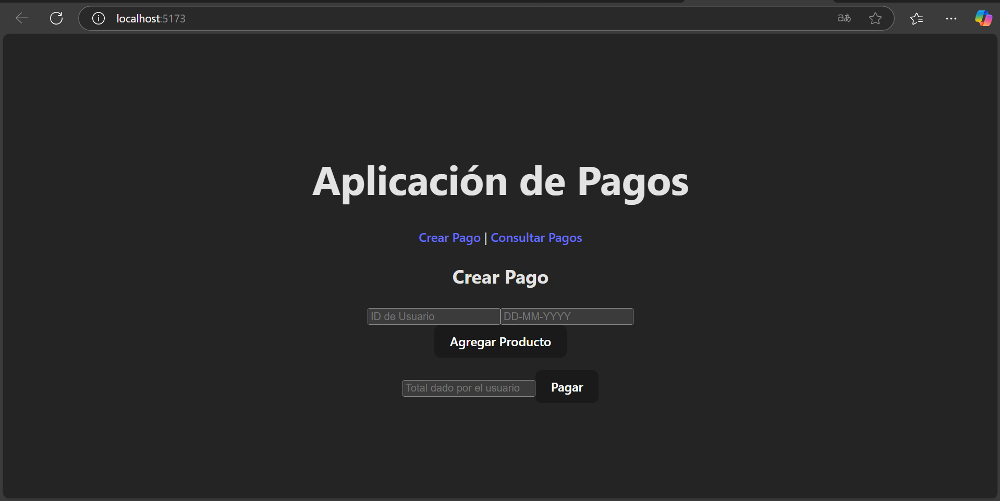
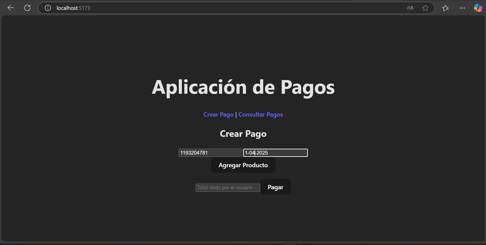
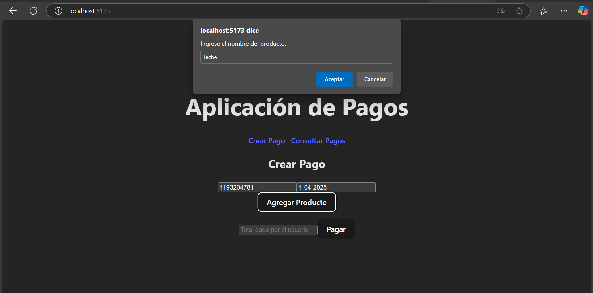
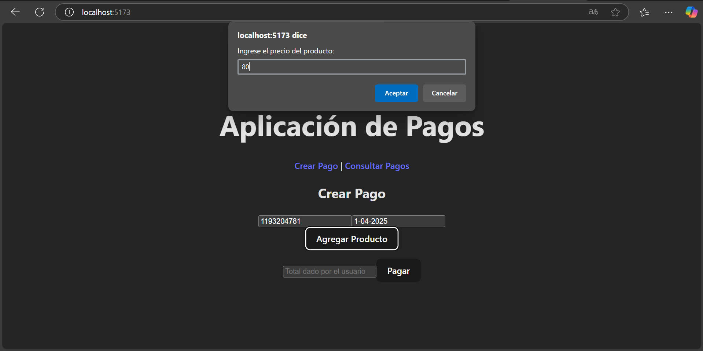
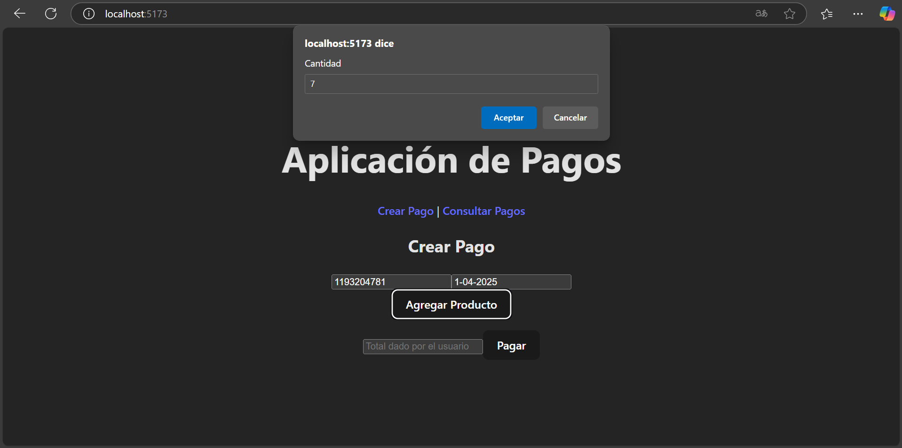
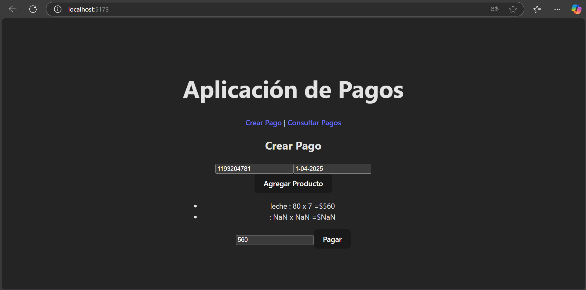
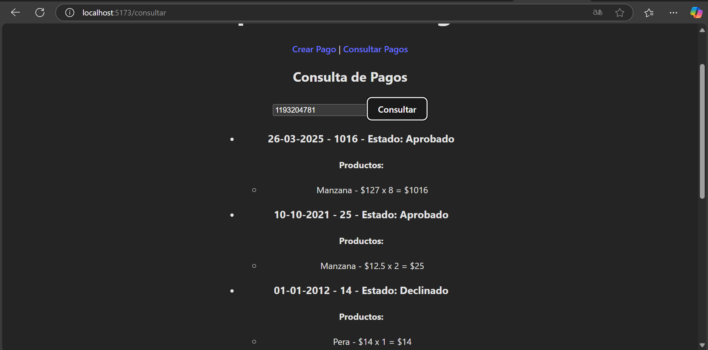

# Front

Este es el proyecto frontend para la solución de gestión de pagos, utilizando React y Vite. El frontend interactúa con el backend desplegado en Azure para registrar y consultar pagos.

## Desarrollado por

- Mayerlly Suárez Correa

## Tecnologías Utilizadas

- **React**
- **Vite**
- **Axios**

1. **Clonar el Repositorio**:

     ```
     git clone https://github.com/corrllr/payment-front
     cd payment-front
     ```

2. **Instalar dependencias**:

   Una vez dentro del proyecto, instala las dependencias necesarias con el siguiente comando:
     ```
     npm install
     ```


3. **Ejecutar el Proyecto**:

   Inicia el servidor:
     ```
     npm run dev
     ```

   Esto iniciará la aplicación en `http://localhost:5173`.

4. **Acceder a la Aplicación**:

   Abrir el navegador y acceder a la siguiente URL:

   ```
   http://localhost:5173
   ```

## Dependencias Instaladas

- **React**: Para la construcción de la interfaz de usuario.
- **Vite**: Para la construcción rápida del proyecto.
- **Axios**: Para las solicitudes HTTP.
- **React Router**: Para el manejo de rutas,
- **CSS/SCSS**: Para la estilización de los componentes.

## Métodos de la API

- **POST** `/api/v1/pagos/{totalUsuario}`: Crear un pago.
- **GET** `/api/v1/pagos/{idUser}`: Obtener los pagos realizados por un usuario.
- **PUT** `/api/v1/pagos/{idPago}/producto`: Añadir un producto a un pago.
- **PUT** `/api/v1/pagos/{idPago}/total`: Validar el total dado por el usuario.

## Funcionalidades Implementadas
### Crear Pago

- Registro de datos del usuario
- Adición de múltiples productos con sus cantidades y precios
- Validación del total ingresado por el usuario
- Visualización del resultado de la transacción (Aprobado/Declinado)

### Consultar Pagos

- Búsqueda de pagos por ID de usuario
- Visualización detallada de pagos incluyendo:

   - Fecha de la transacción
   - Productos adquiridos
   - Estado del pago
   - Monto total

## Capturas del Frontend

### Página de Inicio


### Creación de Pago - ID de Usuario y Fecha


### Creación de Pago - Nombre del Producto


### Creación de Pago - Precio del Producto


### Creación de Pago - Cantidad del Producto


### Pago del Producto


### Confirmación de Producto Pagado


### Consulta de Pagos
